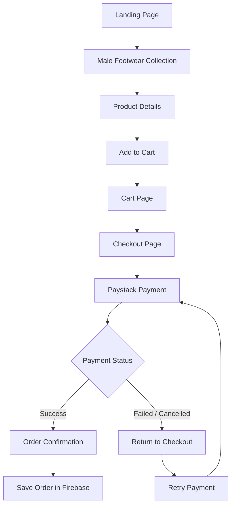

# Male Footwear E-commerce Workflow

## Scope
- Product focus: **Male Footwear only**
- Flow covered: **Landing Page → Checkout**
- Platform context: Vanilla JS frontend, Firebase backend, Paystack payments

## Customer Flow (Landing to Checkout)

1. **Landing Page**
   - User lands on homepage.
   - Hero section highlights male footwear brand message.
   - Featured male footwear products are displayed.
   - Primary CTA: **Shop Men’s Shoes**.

2. **Male Footwear Collection Page**
   - User clicks **Shop Men’s Shoes**.
   - Collection grid shows all male footwear products.
   - User can:
     - Browse product cards (image, name, price).
     - Filter by type (loafers, sneakers, formal, boots, sandals).
     - Sort by price/new arrivals/popular.

3. **Product Details Page**
   - User opens a product.
   - Product page shows:
     - Multiple images.
     - Product description.
     - Available sizes.
     - Price.
     - Stock status.
   - User selects size and quantity.
   - User clicks **Add to Cart**.

4. **Cart Page**
   - Cart displays selected male footwear items.
   - User can:
     - Increase/decrease quantity.
     - Remove item.
     - Continue shopping.
   - Cart shows subtotal and estimated delivery fee.
   - User clicks **Proceed to Checkout**.

5. **Checkout Page**
   - User enters delivery details:
     - Full name.
     - Email.
     - Phone number.
     - Delivery address.
   - Order summary is shown (items, quantity, total amount).
   - User clicks **Pay with Paystack**.

6. **Paystack Payment Step**
   - System initializes transaction with a unique reference.
   - User completes payment on Paystack.
   - Payment result returns to site (success/failure).

7. **Post-Payment Checkout Completion**
   - On success:
     - Order is confirmed.
     - Confirmation page is shown with order reference.
     - Order record is saved in Firebase.
   - On failure/cancel:
     - User returns to checkout with status message.
     - User can retry payment.

## Simple Visual Flow

Landing Page  
→ Male Footwear Collection  
→ Product Details  
→ Add to Cart  
→ Cart  
→ Checkout  
→ Paystack Payment  
→ Order Confirmation

## Pictorial Flow Diagram

